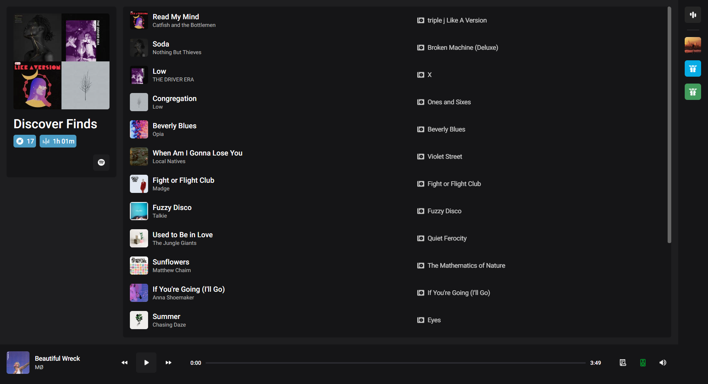

  

  <h3 align="center">MixJam</h3>

  

    Listen to your favorite music, together
     
    <a href="https://mixjam.io">mixjam.io</a>
  

## About The Project

   
  
   

MixJam connects to your Spotify Premium account and controls playback through API calls. Once you link your account, you can create a room and invite your friends to come join in on the music. There are some other sites that do something similar to this, but there is no good one for Spotify users. 

Here's why MixJam is better:
* A room's music is based off of a Spotify playlist, meaning you don't have to be on the site to enjoy the playlist
* Unlike other sites that have you add videos, a Spotify playlist is purely audio
* The interface is much simpler and more intuitive

### Built With

* [Django](https://www.djangoproject.com/)
* [jQuery](https://www.jquery.com/)

## Contact

Email: nick.gilliam2@gmail.com

Project Link: [https://github.com/NickJGG/mixjam](https://github.com/NickJGG/mixjam)
